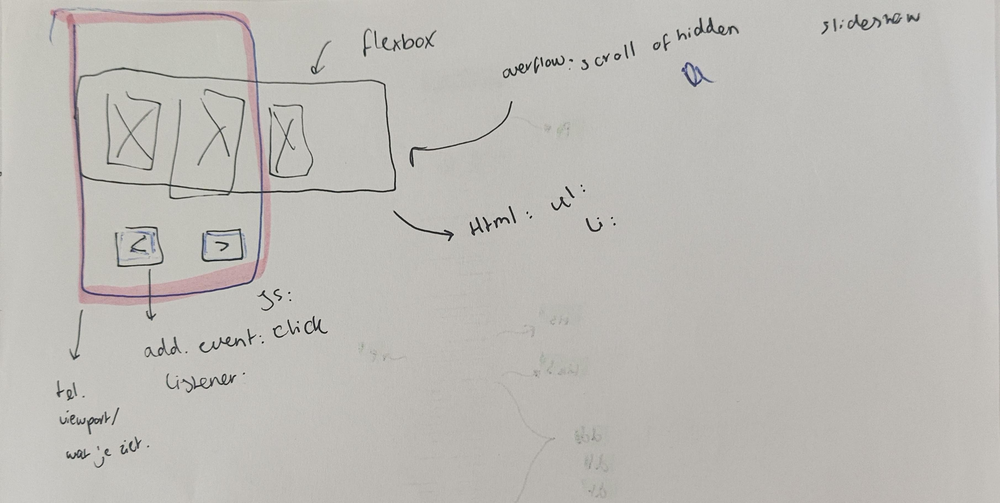

# Procesverslag
Markdown is een simpele manier om HTML te schrijven.  
Markdown cheat cheet: [Hulp bij het schrijven van Markdown](https://github.com/adam-p/markdown-here/wiki/Markdown-Cheatsheet).

Nb. De standaardstructuur en de spartaanse opmaak van de README.md zijn helemaal prima. Het gaat om de inhoud van je procesverslag. Besteedt de tijd voor pracht en praal aan je website.

Nb. Door *open* toe te voegen aan een *details* element kun je deze standaard open zetten. Fijn om dat steeds voor de relevante stuk(ken) te doen.

## Jij

  
uitwerken voor kick-off werkgroep

  ### Auteur:
  Sosan Shirzai

  #### Je startniveau:
  Blauw

  #### Je focus:
  Responsive plane
 

## Je website

  
uitwerken voor kick-off werkgroep

  ### Je opdracht:
  Lucardi.nl

  #### Screenshot(s) van de eerste pagina (small screen): 
  Homepage van lucardi.nl
  
  #### Screenshot(s) van de tweede pagina (small screen):
  Artikelpagina van artikel op lucardi
  
 

## Toegankelijkheidstest 1/2 (week 1)

  
uitwerken na test in 2e werkgroep

  ### Bevindingen
  Lijst met je bevindingen die in de test naar voren kwamen:
  Ik heb Safae haar website gecheckt met een screenreader op mijn macbook.
  Haar website was die van pllaystation 5. De link naar de website: 

  Ik heb hier mijn bevindingen in een lijst met bullets gezet:

  De screenreader:

  <ul>
  <li> De screen reader werkt wel goed bij de navigatiebalk.
  <li> Niet alle afbeeldingen of vectorshadden een extra tekst eronder. Dit zorgde voor veel verwarring waardoor ik alleen "Image.....Image......Image" te horen kreeg. Wel een pluspunt is dat de meeste afbeeldingen wel een alt tekstje hadden. Dus je wist over welke games het ging.
  <li> Er is gelukkig een button met naar hoofdcontent gaan, zodat je niet de hele website af moet.
  <li> Bij een video dat zich afspeelt is er een pauze button. Er wordt geen context gegeven over waar die pauze button is en de video zelf heeft ook geen uitleg.
  <li> De meeste tekst was in het nederlands, maar werd voorgelezen in het engels. Dit maakt het onverstaanbaar en niet te begrijpen.
  <li> Er is een slideshow met games en er werd maar 1 game opgenoemt, voor de rest las het de balkje voor als: "Button...........Button.............Button".
  </ul>

  Voor de rest hadden wij tijdens de les nog brillen opgedaan en een machine getest die schokjes gaf en je hetzelfde bibber handen gaf net als Parkinsons. 
  Het was erg moeilijk om te lezen en en om iets op de zoekbalk te schrijven op de laptop.
  Al in al, de ervaring was erg frustrerend. Nu begrijp ik waarom er meer aandacht moet komen voor toegankelijkheid. Ik vind het knap hoe mensen met een beperking het tot nu toe doen op het internet of uberhaupt met moderne technologie. Ik heb enorme respect voor deze mensen.

## Breakdownschets (week 1)

  
uitwerken na afloop 3e werkgroep

  ### de hele pagina (main scherm): 
  

  ### de hele pagina (artikel scherm):
  

  

  ### dynamisch deel (Review section): 
  

  ### wellicht nog een dynamisch deel (Automatische slideshow): 
  

## Voortgang 1 (week 2)

  
uitwerken voor 1e voortgang

  ### Stand van zaken
  Met het opstellen van een html-pagina ging het best prima. Ik was bij de artikel omschrijvingen wel in de war, want ik wist niet hoe ik de dl, dt tag moest toepassen om de uitklapmenu moest krijgen. Voor de rest, dit is iets voor mijzelf om mee te nemen voor de rest van mijn projecten ooit: download de foto's gelijk!!! Mijn website is snel verandert van acties, dus ik zocht met moeite alle structuur en foto's op via mijn github website screenshot.

  ### Agenda voor meeting
  samen met je groepje opstellen

  | student 1: Sosan      | student 2: Demi          | student 3: Chiara    | student 4        |
  | ---            | ---                | ---          | ---              |
  | HTML slideshow bespreken  | Hoe zet je een button over de image             | Classes speciferen, hoe en wanneer?    | en dan ik dat    |
  | Details, dt en dd tags toepassing in code | dit als er tijd is | nog een punt | dit wil ik zeker |
  | ...            | ...                | ...          | ...              |

  ### Verslag van meeting
  hier na afloop snel de uitkomsten van de meeting vastleggen

  - De details and summary tags zijn goed toegepast op de code, je hoeft het niet apart te stylen om die effect te krijgen.
  - De nav mag in de header. De header tag kwam er niet voor. Ook kan er ul en li's gebruikt worden.
  - Nog aandacht besteden aan de H1, H2 en H3's hoe die gebruikt wordt. Want er word van de een naar de ander gesprongen, denk er goed over na.
  - Slideshow kan simpel met flexbox etc....

  Bronnen gebruikt: Bron 1.

## Voortgang 2 (week 3)

  
uitwerken voor 2e voortgang

  ### Stand van zaken
  hier dit ging goed & dit was lastig (neem ook screenshots op van delen van je website en code)

  ### Agenda voor meeting
  samen met je groepje opstellen

  | student 1      | student 2          | student 3    | student 4        |
  | ---            | ---                | ---          | ---              |
  | Html structuur  | en dit             | en ik dit    | en dan ik dat    |
  | aanpak welke namaken en css | dit als er tijd is | nog een punt | dit wil ik zeker |
  | ...            | ...                | ...          | ...              |

  ### Verslag van meeting
  hier na afloop snel de uitkomsten van de meeting vastleggen

  - punt 1
  - punt 2
  - nog een punt
- ...

## Toegankelijkheidstest 2/2 (week 4)

  
uitwerken na test in 9e werkgroep

  ### Bevindingen
  Lijst met je bevindingen die in de test naar voren kwamen (geef ook aan wat er verbeterd is):

## Voortgang 3 (week 4)

  
uitwerken voor 3e voortgang

  ### Stand van zaken
  hier dit ging goed & dit was lastig (neem ook screenshots op van delen van je website en code)

  ### Agenda voor meeting
  samen met je groepje opstellen

  | student 1      | student 2          | student 3    | student 4        |
  | ---            | ---                | ---          | ---              |
  | dit bespreken  | en dit             | en ik dit    | en dan ik dat    |
  | en dat ook nog | dit als er tijd is | nog een punt | dit wil ik zeker |
  | ...            | ...                | ...          | ...              |

  ### Verslag van meeting
  hier na afloop snel de uitkomsten van de meeting vastleggen

  - punt 1
  - punt 2
  - nog een punt
  - ...

## Eindgesprek (week 5)

  
uitwerken voor eindgesprek

  ### Je uitkomst - karakteristiek screenshots:
  

  ### Dit ging goed/Heb ik geleerd: 
  Korte omschrijving met plaatjes

  

  ### Dit was lastig/Is niet gelukt:
  Korte omschrijving met plaatjes

  

## Bronnenlijst

  
continu bijhouden terwijl je werkt

  Nb. Wees specifiek ('css-tricks' als bron is bijv. niet specifiek genoeg). 
  Nb. ChatGpT en andere AI horen er ook bij.
  Nb. Vermeld de bronnen ook in je code.

  1. W3Schools.com. (12-9-2024). https://www.w3schools.com/tags/tag_dd.asp
  2. Hmaburger menu website: Repo, S., Repo, S., Repo, S., Repo, S., Repo, S., Repo, S., Repo, S., Repo, S., Repo, S., Repo, S., Repo, S., Repo, S., Repo, S., Repo, S., Repo, S., Repo, S., Repo, S., Repo, S., Repo, S., . . . Repo, S. (n.d.). Hamburger Menu Vector SVG Icon - SVG Repo. SVG Repo. https://www.svgrepo.com/svg/312300/hamburger-menu
  3. https://www.w3schools.com/tags/ref_pxtoemconversion.asp

